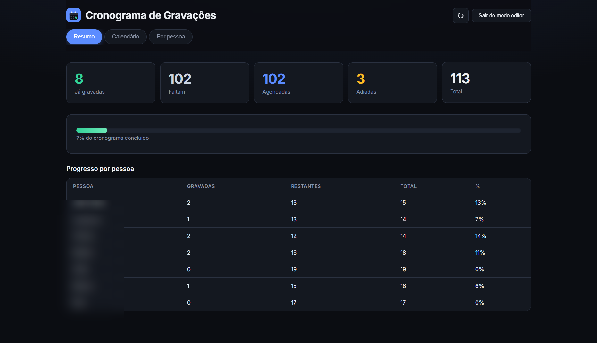

# Cronograma de Gravações

Painel web para coordenar as gravações de vídeo das funcionalidades do sistema — sem planilha infinita, sem mensagem gigante no Discord.

Substitui o “texto corrido” da coordenação por um cronograma vivo: quem grava o quê, o que já foi gravado, o que foi adiado e o que ainda falta, em uma única URL que qualquer pessoa da equipe pode abrir.

---

## O problema que resolve

Em projetos com dezenas de tópicos e várias pessoas gravando, o cronograma vira um arquivo difícil de manter:

- Não dá para ver de relance o progresso geral.
- Remarcar um dia ou trocar horário vira edição manual e risco de erro.
- Quem só precisa **consultar** acaba no mesmo canal de quem **altera** tudo.

Este painel centraliza a agenda em dados estruturados e oferece três formas de enxergar a mesma informação, com alterações controladas e confirmação antes de gravar no banco.

---

## O que você ganha

| Antes | Com o painel |
|--------|----------------|
| Texto longo ou planilha compartilhada | Resumo numérico e barras de progresso |
| “Quem grava hoje?” exige busca manual | Calendário mensal com o dia e os horários |
| Status espalhado por mensagens | Marcar gravado, adiar ou remarcar na interface |
| Medo de clicar errado | Fila de alterações + modal de confirmação antes de salvar |

**Público:** coordenação do treinamento e quem grava. **Uso típico:** abrir a URL publicada, acompanhar o dia, atualizar o cronograma após cada gravação ou imprevisto.

---

## Funcionalidades

### Resumo

Visão executiva: quantas gravações já foram feitas, quantas faltam, adiadas e agendadas, com percentual global e tabela por pessoa.

### Calendário

Grade mensal com as sessões do dia (horários padrão 14h e 16h, com opção de **outro horário** quando alguém grava fora da faixa). Arraste para mudar o dia mantendo o horário; no detalhe do dia, marque como gravada, adie, troque ordem no mesmo dia ou ajuste o horário. Lista de **adiadas** com reagendamento por data e hora.

### Por pessoa

Progresso individual e checklist por tópico (a, b, c…), para ver de uma vez o que cada gravador ainda deve entregar.

### Modo leitura e modo editor

- **Qualquer visitante** da URL vê o cronograma completo (ideal para link fixo no canal da equipe).
- **Edição** exige entrar no modo editor (senha da equipe, salva no navegador para não digitar sempre).
- Alterações ficam em **rascunho** até você revisar tudo no modal **Confirmar alterações** e salvar de uma vez no banco.

---

## Segurança em uma frase

Repositório e painel podem ser públicos: ver é aberto; mudar o cronograma só com autenticação de editor. Detalhes e alternativas avaliadas estão em [docs/seguranca.md](docs/seguranca.md).

---

## Começar a usar

**Quem só consulta:** acesse a URL publicada (ex.: Render) — não precisa instalar nada.

**Quem desenvolve ou hospeda:**

1. Clone o repositório e instale dependências: `yarn`
2. Configure Supabase e variáveis de ambiente (guia passo a passo)
3. Suba localmente: `yarn dev` → http://localhost:3333

---

## Stack (resumo)

React + Vite no front, API Node/Express, persistência das sessões no **Supabase**. Catálogo de pessoas e tópicos versionado no repositório; estado da agenda (gravado, adiado, datas) no banco.

Especificação técnica completa: **[docs/context.md](docs/context.md)**.

---

## Licença

MIT — ver [LICENSE](LICENSE).
